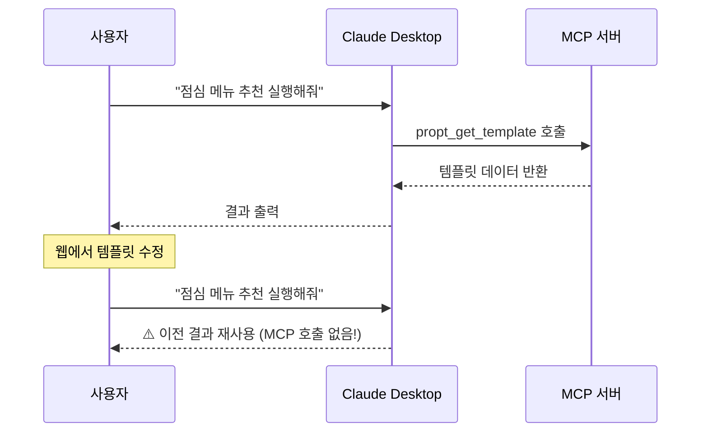
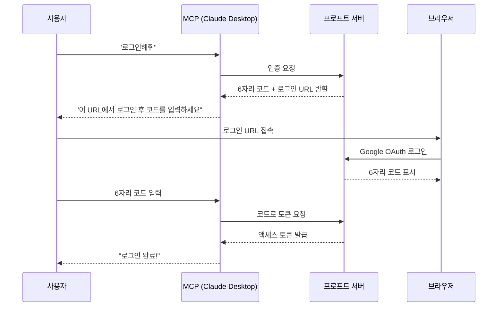

<div align="center">

# 프로프트 (Propt)

**한 번의 프롬프팅으로 여러 번의 답변을 얻으세요**

[프로프트 체험해보기](https://www.propt.site/)

<br>

같은 프롬프트를 복사해서 붙여넣고, 변수만 바꿔서 다시 실행하고...

프로프트는 반복 작업에 AI를 쓰면서, 정작 반복은 사람이 하고 있는 문제를 해결하기 위해 등장했습니다.

<br>

> 프롬프트를 **템플릿**으로 저장하고, <br>
> 변수만 바꿔서 **배치 실행**하며, <br>
> Claude Desktop에서 **MCP로 바로 호출**합니다.

</div>

<br>
<br>
<br>

# Features

프로프트의 모든 기능은 "반복 가능한 AI 작업"을 위해 설계되었습니다.

<br>

## 템플릿 관리

자주 쓰는 프롬프트를 템플릿으로 저장하세요.

`{변수명}` 형식으로 작성하면, 변수가 자동으로 추출됩니다.

변수에 설명을 붙여두면 나중에 "이 변수가 뭐였지?" 고민할 필요가 없습니다.

<br>

## MCP 연동

MCP Server 연결을 통해 프로프트 템플릿을 바로 실행할 수 있습니다.

점심 메뉴 추천부터 코드 리뷰까지, "프로프트" 접두사만 붙여 바로 실행해보세요.

<br>

## 배치 실행

여러 입력값에 대해 동일한 프롬프트를 한 번에 실행합니다.

각 항목은 독립적으로 처리되어, 앞선 응답이 뒤의 응답에 영향을 주지 않습니다.

10개의 제품 설명을 작성해야 한다면, 10번 복붙하지 마세요.

<br>

*변수 목록만 넘기면, 나머지는 프로프트가 처리합니다.*

---
<br>

# 🛠️ 트러블슈팅: LLM과 협업하는 시스템의 함정들

프로프트는 LLM과 MCP로 통신하는 시스템입니다.

개발 과정에서 **"LLM은 우리가 기대하는 대로 동작하지 않는다"** 는 사실을 여러 번 마주했습니다.

<br>

## 1️⃣ LLM의 캐싱 본능

### 문제 상황

Claude Desktop에서 템플릿을 실행한 후, 웹에서 내용을 수정하고 다시 실행했습니다.

**수정된 내용이 반영되지 않았습니다.**



### 원인 분석

이것은 버그가 아니라 **Claude의 최적화 동작**이었습니다.

Claude는 대화 내에서 토큰 효율성을 추구합니다.

"이미 조회한 데이터를 왜 다시 조회하지?"라고 판단하면, 도구 호출 없이 기존 응답을 재활용합니다.

문제는 프로프트의 템플릿이 "고정된 참조 데이터"가 아니라 **"실시간으로 변하는 사용자 데이터"** 라는 점이었습니다.

### 해결 방법

Claude에게 **"이 데이터는 휘발성이다"** 라는 신호를 보내야 했습니다.

**1. 도구 설명에 경고 추가**

```
⚠️ 중요: 템플릿 내용은 사용자가 언제든 수정할 수 있습니다.
템플릿을 실행할 때마다 반드시 이 도구를 호출하여 최신 데이터를 가져오세요.
```

**2. 응답에 타임스탬프 삽입**

```
📄 템플릿 상세 (조회 시점: 2024-01-25T14:30:00.000Z)

{ ...템플릿 데이터... }

---
⚠️ 이 데이터는 조회 시점의 내용입니다.
같은 템플릿이라도 다음 실행 시 반드시 다시 조회하세요.
```

타임스탬프가 매번 바뀌니, Claude는 "새로운 데이터"로 인식하고 매번 도구를 호출합니다.

<br>

*LLM은 맥락에서 데이터의 성격을 추론합니다. 휘발성 데이터라면, 명시적으로 알려야 합니다.*

---
<br>

## 2️⃣ 정보 ≠ 지시

>_"알고 있는 것과 행동하는 것은 다르다."_<br>
>_— 지식과 실천의 간극_

### 문제 상황

템플릿에 `outputType: "markdown"`을 설정했는데, Claude가 **일반 텍스트로 응답**했습니다.

API 응답을 확인하니 `outputType` 필드는 정상적으로 전달되고 있었습니다.

```json
{
  "title": "점심 메뉴 추천",
  "content": "점심 메뉴 추천해주세요",
  "outputType": "markdown"  // ✅ 정상 전달됨
}
```

그런데 왜 무시되었을까요?

### 원인 분석

**JSON 데이터는 "정보"로 인식되지, "지시"로 해석되지 않았습니다.**

| 유형 | LLM의 해석 | 예시 |
|------|-----------|------|
| 정보 | "참고할 데이터군" | `{"outputType": "markdown"}` |
| 지시 | "이렇게 행동해야 함" | `응답을 마크다운으로 작성하세요` |

Claude는 JSON을 보고 "아, outputType이 markdown이군" 하고 **인지**만 했을 뿐, **행동**으로 옮기지 않았습니다.

### 해결 방법

JSON 데이터 뒤에 **명시적인 지시문**을 추가했습니다.

```
{
  "title": "점심 메뉴 추천",
  "outputType": "markdown",
  ...
}

<output_instruction>
응답 전체를 마크다운 코드 블록(```markdown)으로 감싸서 작성해주세요.
</output_instruction>
```

구조화된 태그(`<output_instruction>`)를 사용하면, Claude가 해당 부분을 **지시사항**으로 명확히 인식합니다.

### 추가 발견: 지시문의 구체성

첫 번째 시도에서도 실패했습니다.

```
❌ "응답을 마크다운 형식으로 작성해주세요"
   → 일반 텍스트로 출력 (실패)

✅ "응답 전체를 마크다운 코드 블록(```markdown)으로 감싸서 작성해주세요"
   → 코드 블록으로 출력 (성공)
```

"마크다운 형식으로"는 해석의 여지가 있었습니다.

"코드 블록으로 감싸서"는 탈출구가 없는 지시였습니다.

<br>

*사람에게는 "마크다운으로 해줘"면 충분합니다. LLM에게는 "코드 블록으로 감싸서"까지 말해야 합니다.*

---
<br>

# 🏗️ 아키텍처: CLI에서 브라우저 인증하기

MCP는 Claude Desktop(CLI 환경)에서 실행됩니다.

그런데 프로프트는 사용자 인증이 필요한 서비스입니다.

**CLI에서 어떻게 브라우저 기반 OAuth 로그인을 처리할 수 있을까요?**

<br>

## 일반적인 OAuth의 한계

표준 OAuth 플로우는 `redirect_uri`를 통해 인증 결과를 전달받습니다.

```
1. 사용자 → 인증 서버: 로그인 요청
2. 인증 서버 → 브라우저: 로그인 페이지 표시
3. 사용자: 로그인 완료
4. 인증 서버 → redirect_uri: 인증 코드 전달
5. 클라이언트: 코드로 토큰 교환
```

**문제**: CLI 환경에는 `redirect_uri`로 받을 수 있는 웹 서버가 없습니다.

<br>

## 해결책: Device Code Flow (RFC 8628)

TV, 게임 콘솔 같은 입력이 제한된 디바이스를 위해 설계된 OAuth 확장입니다.

프로프트는 이 방식을 MCP 인증에 적용했습니다.



### 보안 고려사항

- **6자리 코드**: 무작위 생성, 3분 후 만료
- **1회성 사용**: 한 번 사용된 코드는 즉시 폐기
- **사용자 확인**: 브라우저에서 직접 로그인해야만 코드 발급

---
<br>

# 🧠 AI 프롬프팅에 대한 이해

LLM과 협업하면서 배운 것들을 정리했습니다.

<br>

## 1️⃣ 출력 형식: 클로드는 텍스트 기반 데이터만 생성할 수 있다

### 문제 상황

초기에는 사용자가 출력 형식을 자유롭게 입력할 수 있었습니다.

"pdf", "docx", "pptx" 같은 값을 입력하는 사용자가 있었습니다.

**문제는 Claude가 텍스트 기반 데이터만 생성할 수 있다는 점이었습니다.**

PDF, DOCX 같은 바이너리 파일은 애초에 생성이 불가능합니다.

사용자는 "왜 PDF가 안 나오지?"라고 혼란스러워했고, 이는 기능의 한계가 아니라 **LLM 자체의 한계**였습니다.

### 해결 방법

**생성 가능한 텍스트 기반 형식만 프리셋으로 제공하기로 결정했습니다.**

| 형식 | 설명 | 지시문 |
|------|------|--------|
| Markdown | 문서 작성 | 마크다운 코드 블록으로 감싸서 작성 |
| JSON | 구조화 데이터 | JSON 코드 블록으로 감싸서 작성 |
| Table | 표 형식 | 마크다운 표 형식으로 작성 |
| Bullet List | 목록 형식 | 불릿 리스트 형식으로 작성 |
| CSV | 데이터 교환 | CSV 코드 블록으로 감싸서 작성 |
| HTML | 웹 콘텐츠 | HTML 코드 블록으로 감싸서 작성 |

자유 입력 필드를 제거하고, 버튼 선택 방식으로 변경했습니다.

---
<br>

## 2️⃣ 배치 실행

### 문제 상황


10개의 제품 설명을 한 번에 요청하면, 모델은 자연스럽게 앞선 응답을 참고합니다.

"A 제품과 마찬가지로...", "앞서 언급한 것처럼..." 같은 표현이 등장하고, 각 응답의 독립성이 무너집니다.

배치 실행의 핵심은 **"같은 프롬프트, 다른 입력, 독립된 결과"**인데, 모델의 최적화 본능이 이를 방해했습니다.

### 목표

> "API 호출 비용 없이 한 번의 입력만으로 독립된 컨텍스트에서 같은 프롬프트를 실행시키고자 하는 것이 궁극적인 목표입니다."

### 1차 시도: 각 항목에 컨텍스트 리셋 프리픽스

각 항목마다 "컨텍스트 초기화" 지시를 붙였습니다.

```
━━━━━━━━━━━━━━━━━━━━━━━━━━━━━━━━━━━━━━━━━━━━━━━━━━━━━━━━━━━
🔄 완전히 새로운 독립 평가 시작 | 컨텍스트 초기화
━━━━━━━━━━━━━━━━━━━━━━━━━━━━━━━━━━━━━━━━━━━━━━━━━━━━━━━━━━━

⚠️ 필수 준수 사항:
✅ 해야 할 것: 현재 제시된 내용만을 기준으로 독립적으로 평가
❌ 절대 하지 말아야 할 것: 이전에 평가한 다른 대상을 언급하거나 비교
━━━━━━━━━━━━━━━━━━━━━━━━━━━━━━━━━━━━━━━━━━━━━━━━━━━━━━━━━━━

사과의 장점을 설명해줘
```

**결과**: 독립성은 개선되었지만, **토큰 낭비** 문제 발생.

10개 항목이면 이 프리픽스가 10번 반복됩니다. 배치 실행의 목적이 "효율성"인데, 오히려 토큰이 더 소모되었습니다.

### 2차 시도: "독립적으로 처리해줘" 지시 추가

프리픽스를 제거하고, 상단에 "각 항목을 독립적으로 처리해주세요"라는 지시만 추가했습니다.

**결과**: 토큰은 절약되었지만, 여전히 "앞서 설명한 것과 유사하게..." 표현 등장.

"독립적으로"라는 지시가 너무 추상적이었습니다.

### 최종 해결: 실행 가이드 통합 + 금지 조건 명시

두 가지 문제를 동시에 해결하는 방식으로 접근했습니다.

**1. 토큰 효율성**: 모든 항목을 하나의 실행 가이드에 통합

```
# 배치 처리 요청 (3건)

## 처리할 항목

[A] 사과의 장점을 설명해줘
[B] 바나나의 장점을 설명해줘
[C] 오렌지의 장점을 설명해줘

## 응답 형식
## [A]
(A에 대한 응답)

## [B]
(B에 대한 응답)
...
```

프롬프트 목록을 JSON으로 나열하는 대신, **Claude가 바로 실행할 수 있는 형태**로 제공합니다.

한 번의 요청으로 모든 항목을 처리하므로 토큰 낭비가 없습니다.

**2. 독립성 보장**: 금지 조건 명시

```
**핵심 원칙:**
- 각 항목은 별개의 요청으로 취급
- 해당 항목의 내용만을 기반으로 응답 생성
- 항목 간 참조나 비교 없이 개별 처리

**주의사항:**
- 다른 항목의 내용을 언급하지 않음
- "다른 항목과 달리", "앞선 내용처럼" 등의 표현 사용 금지
- 각 응답은 해당 항목만 보고 작성한 것처럼 구성
```

또한 도구 자체를 분리하여, **템플릿 조회(`propt_get_template`)와 배치 준비(`propt_prepare_batch`)를 별개의 단계**로 나눴습니다.

이렇게 하면 Claude가 "배치 준비" 도구를 호출하는 순간, 실행 가이드를 받아 그대로 따르게 됩니다.

### 토큰 사용량 비교 (10개 항목 기준)

| 방식 | 구조 | 예상 토큰 | 독립성 |
|------|------|----------|--------|
| 1차: 프리픽스 반복 | 프리픽스(~150자) × 10 + 프롬프트 × 10 | ~2,000 | ✅ |
| 2차: 상단 지시만 | 지시(~50자) × 1 + 프롬프트 × 10 | ~500 | ❌ |
| **최종: 실행 가이드** | 가이드(~200자) × 1 + 프롬프트 × 10 | **~600** | **✅** |

1차 방식 대비 약 **70% 토큰 절감**하면서 독립성도 확보했습니다.

---
<br>

## 🛠️ Tech Stack

| Category | Technologies |
|----------|--------------|
| **Frontend** |    |
| **Backend** |    |
| **Styling** |   |
| **State** |   |
| **Infra** |   |

---
<br>

## 📂 Project Structure

```bash
propt/
├── propt-backend/                 # NestJS 백엔드
│   ├── src/
│   │   ├── auth/                  # OAuth, JWT, Device Code Flow
│   │   ├── template/              # 템플릿 CRUD
│   │   ├── mcp/                   # MCP 서버 (SSE 방식)
│   │   ├── prisma/                # 데이터베이스
│   │   └── common/                # 공통 유틸리티
│   │
│   └── mcp/                       # 독립 MCP 패키지 (Stdio 방식)
│       └── src/
│           ├── tools/             # MCP 도구 구현
│           └── auth/              # 로컬 토큰 저장 (Keytar)
│
└── propt-frontend/                # React 프론트엔드
    └── src/
        ├── components/
        │   ├── template/          # 템플릿 편집 UI
        │   ├── preview/           # 미리보기 패널
        │   └── sidebar/           # 템플릿 목록
        ├── stores/                # Zustand 상태 관리
        ├── hooks/                 # 커스텀 훅 (자동 저장 등)
        └── lib/                   # API 클라이언트, 유틸리티
```

---
<br>

# 🚀 Getting Started

## 1. Prerequisites
- Node.js 18+
- PostgreSQL
- Claude Desktop (MCP 사용 시)

<br>

## 2. Installation

```bash
git clone https://github.com/your-repo/propt.git
cd propt

# 백엔드
cd propt-backend
npm install
npx prisma migrate dev
npm run start:dev

# 프론트엔드 (새 터미널)
cd propt-frontend
npm install
npm run dev
```

<br>

## 3. MCP 설정 (Claude Desktop)

Claude Desktop의 설정 파일에 다음을 추가합니다.

**macOS**: `~/Library/Application Support/Claude/claude_desktop_config.json`

```json
{
  "mcpServers": {
    "propt": {
      "command": "node",
      "args": ["/path/to/propt/propt-backend/mcp/dist/index.js"]
    }
  }
}
```

<br>

## 4. 사용 방법

1. 웹에서 템플릿 생성 및 저장
2. Claude Desktop에서 "프로프트 로그인해줘"
3. 브라우저에서 로그인 후 6자리 코드 확인
4. Claude Desktop에 코드 입력
5. "점심 메뉴 추천 템플릿 실행해줘"

---
<br>

# License

This project is licensed under the [MIT License](LICENSE).
